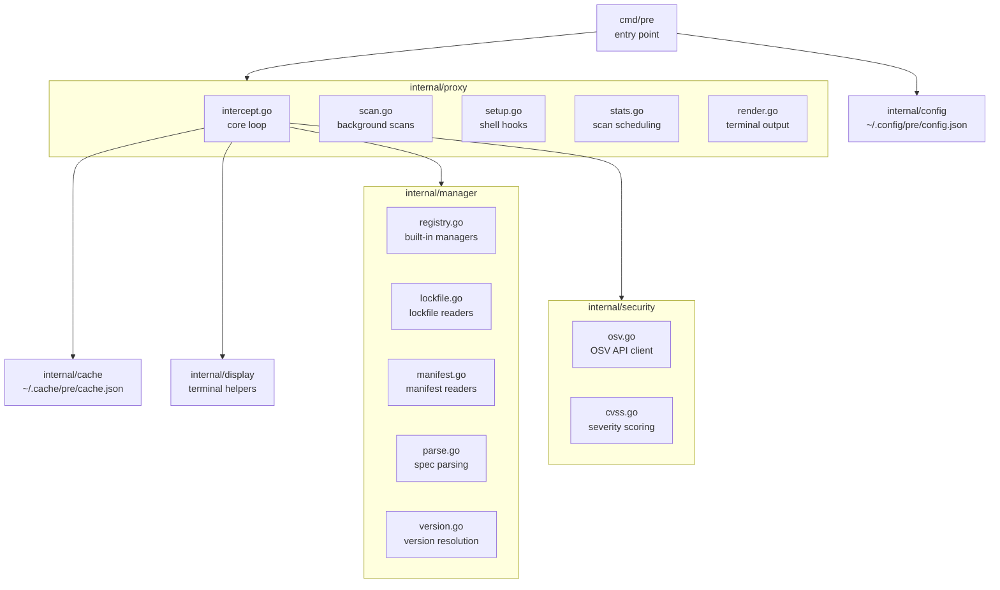

# Contributing

## Setup

```sh
git clone https://github.com/yowainwright/pre.git
cd pre
go build ./...
```

## Workflow

1. Branch off `main`
2. Make changes
3. Run `make test` (unit) and `make lint`
4. Run `make script-test` if touching installer, setup, or release scripts
5. Run `make e2e` if touching intercept or setup logic (requires npm)
6. Run `make security` before release-sensitive changes (requires network)
7. Open a PR

## Testing

```sh
make test        # unit tests
make e2e         # end-to-end tests (requires npm)
make integration # live API calls (requires network)
make script-test # shell script tests
make lint        # gofmt check + go vet
make gosec       # static security checks (requires Go 1.26+)
make vuln        # govulncheck (requires network)
make security    # govulncheck + gosec
make screenshots # TUI SVG screenshots for PRs
```

## Code Style

- No comments unless logic is non-obvious
- No external runtime dependencies without a clear security and maintenance justification
- All new behavior covered by tests

## Project layout


