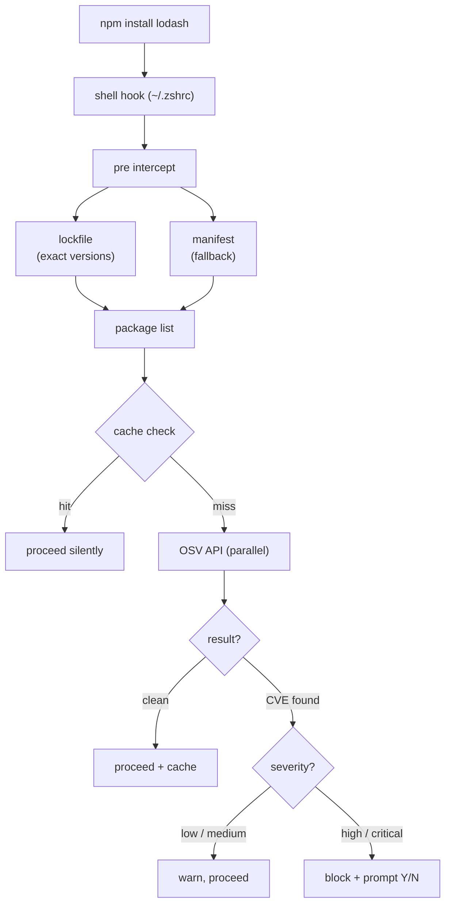
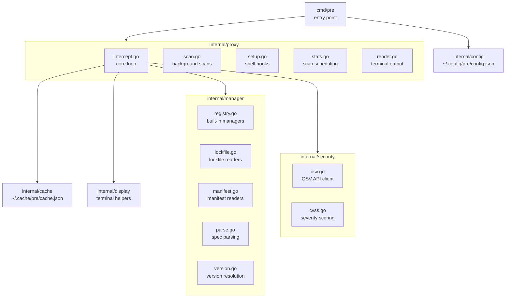

# pre≋≈~∿

Security proxy for package managers. Sits between your shell and `npm`, `pip`, `brew`, and friends — checks packages against the [OSV vulnerability database](https://osv.dev) before anything installs.

[](https://github.com/yowainwright/pre/actions/workflows/test.yml)
[](https://github.com/yowainwright/pre/releases)
[](LICENSE)

Zero config. Zero dependencies. One binary.

## Install

```sh
# Homebrew
brew install yowainwright/tap/pre

# or curl (macOS + Linux)
curl -fsSL https://raw.githubusercontent.com/yowainwright/pre/main/install.sh | sh
```

Every release ships with SHA256 checksums and a cosign signature. The install script verifies the checksum automatically; cosign verification runs if `cosign` is on your PATH.

## Setup

```sh
pre setup    # adds shell hooks to ~/.zshrc or ~/.bashrc
pre teardown # removes them
```

After setup, every `npm install`, `pip install`, `brew install`, etc. goes through `pre` automatically — no extra commands needed.

## Demo

```sh
make demo
```

Requires Docker. Builds a container with `pre` installed and shell hooks active, then plays through real scans across npm and pip — clean installs, CVE detection, and blocked installs. Colors render fully via the TTY allocated by `docker run -it`.

## How it works



### What you'll see

| Situation | Output |
|-----------|--------|
| Everything cached and clean | Silent — install proceeds |
| New packages, no issues | `scanning 12 packages... all clean` |
| Low/medium CVE | Warning printed, install proceeds |
| High/critical CVE | CVE detail box shown, Y/N prompt |

### Lockfile-first scanning

`pre` reads lockfiles for exact pinned versions (including transitive deps) before falling back to manifests:

| Manager | Lockfiles |
|---------|-----------|
| npm / bun / pnpm | `package-lock.json` → `bun.lock` → `pnpm-lock.yaml` |
| go | `go.sum` |
| pip / uv / poetry | `uv.lock` → `poetry.lock` → `Pipfile.lock` |
| brew | `Brewfile.lock.json` |

Supported managers: `brew`, `npm`, `pnpm`, `bun`, `go`, `pip`, `pip3`, `uv`, `poetry`

## Commands

```sh
pre setup                     # inject shell hooks
pre teardown                  # remove shell hooks
pre status                    # managers, cache size, last system scan
pre config                    # show current config
pre config set <key> <value>  # update a config value
pre scan system               # scan all cached packages now
```

## Configuration

`~/.config/pre/config.json` — edit directly or use `pre config set`.

| Key | Default | What it does |
|-----|---------|--------------|
| `api.endpoint` | `https://api.osv.dev/v1/query` | OSV-compatible API to query |
| `cache.ttl` | `24h` | How long a clean result is trusted |
| `systemScan` | `false` | Weekly background scan of cached packages |
| `systemTTL` | `168h` | How often the background scan runs |
| `managers` | — | Add or override managers |

**Quick examples:**

```sh
pre config set cache.ttl 12h
pre config set systemScan true
PRE_CACHE_TTL=0s npm install   # bypass cache for one install
```

**Custom manager** (add to `managers` array in config):

```json
{
  "name": "composer",
  "ecosystem": "Packagist",
  "installCmds": ["install", "require"]
}
```

Entries matching a built-in `name` replace it; new names extend the list.

## Security model

- Queries [OSV.dev](https://osv.dev) — Google-operated, free, open
- Only package name + version leave your machine — no code uploaded
- Lockfile-first ensures transitive deps are checked, not just top-level
- Binaries signed with cosign (sigstore keyless) on every release
- SHA256 checksums for all platforms

## Uninstall

```sh
pre teardown && rm $(which pre)
# or: brew uninstall pre
```

## Project layout



## Development

```sh
make setup       # install deps, verify secrets, install git hooks
make test        # unit tests
make e2e         # end-to-end (requires npm)
make integration # live API calls (requires network)
make lint        # format check + vet
make snapshot    # local release dry-run (all 4 binaries, no publish)
make demo        # run in Docker
```

## License

MIT
