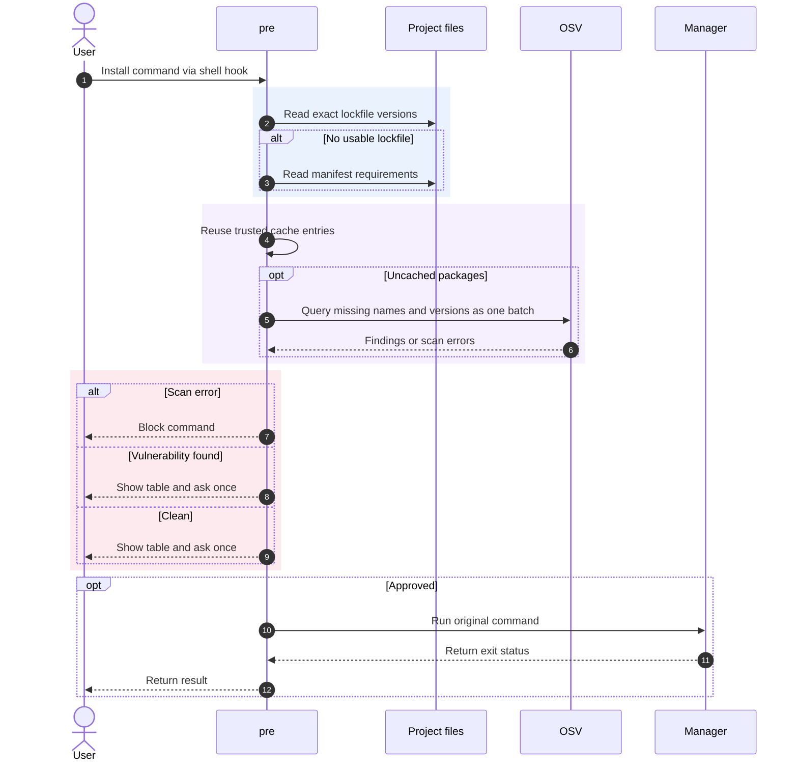

# pre≋≈~∿

Security guardrail for package managers. `pre` sits between your shell and `npm`, `pip`, `brew`, and friends. It checks requested versions and existing lockfiles against the [OSV vulnerability database](https://osv.dev) before the package manager runs.

[](https://github.com/yowainwright/pre/actions/workflows/test.yml)
[](https://github.com/yowainwright/pre/releases)
[](LICENSE)

Zero config. One runtime binary.

## Install

### Homebrew

```sh
brew install --cask yowainwright/tap/pre
```

The macOS cask is checksum-verified but not notarized; its install hook removes quarantine only from the staged `pre` binary.

### Curl

For macOS and Linux; requires `cosign` on `PATH`.

```sh
curl -fsSL https://raw.githubusercontent.com/yowainwright/pre/main/install.sh | sh
```

Every release includes SHA-256 checksums and a Cosign signature. The curl installer requires `cosign` and verifies both before writing the binary. A missing bundle, missing `cosign` binary, or failed signature blocks installation.

## Setup

```sh
pre setup
```

Adds shell hooks to `~/.zshrc` or `~/.bashrc`. Supported install commands in interactive Zsh and Bash sessions then go through `pre` automatically. Scripts and CI can call `pre <manager> ...` directly.

[Check status](#pre-status) or [remove the hooks](#pre-teardown).

## Emergency controls

If anything goes wrong, bypass `pre` without editing shell files:

### Bypass one command

```sh
PRE_DISABLE=1 npm install react
```

### Bypass the current session

```sh
export PRE_DISABLE=1
```

To remove interception permanently, [remove the hooks](#pre-teardown) or [uninstall pre](#uninstall-pre).

### Runtime switches

| Env var | What it does |
|---------|--------------|
| `PRE_DISABLE=1` | Bypasses all `pre` scans and runs the package manager directly |
| `PRE_QUIET=1` | Hides scan progress and clean summaries; vulnerabilities and errors still print |
| `PRE_MAX_PACKAGES=N` | Blocks installs that expand beyond `N` packages; manual `pre scan system` skips instead |
| `PRE_CACHE_MAX_ENTRIES=N` | Prunes the approval cache to at most `N` entries |
| `PRE_CACHE_MAX_BYTES=N` | Prunes the approval cache to at most `N` bytes |
| `PRE_OBS=0` | Disables local obs event recording |
| `PRE_OBS_DIR=PATH` | Writes obs events to an alternate local state directory |

## Install safety flow

`pre` does its work inline: load the bounded approval cache, scan cache misses,
ask once when needed, then either start the package manager or exit before the
install begins.

`PRE_MAX_PACKAGES` protects the machine by stopping installs that are too large
to preflight safely. `PRE_DISABLE=1` is the explicit bypass.

## Package manager UI

```sh
pre manage
```

`pre manage` opens a full-screen view of installed packages across detected managers. Short alias: `pre m`.

| Key | Action |
|-----|--------|
| `↑` / `↓` or `j` / `k` | Move between packages |
| `/` | Search as you type |
| `m` | Toggle managers |
| `enter` or `o` | Open package actions |
| `x` or `esc` | Close a dialog |
| `q` or `ctrl+c` | Exit |

The default theme uses Catppuccin Mocha colors. Set `PRE_MANAGE_THEME=contrast` for a brighter theme or `PRE_MANAGE_THEME=mono` for no color.

Actions run through `pre <manager> ...`, so installs and downgrades are scanned first.

`uv` targets the active environment with `uv pip`. Cargo edits project dependencies with `cargo add`, `cargo update`, and `cargo remove`.

For non-interactive package actions, see [Commands](#commands).

## Docker E2E tests

Requires Docker. Each scenario builds the same E2E container with `pre` installed and shell hooks active, then covers clean scanning, CVE detection, and a blocked install for one package manager.

### `make test-e2e-list`

List available Docker scenarios.

### `make test-e2e-docker E2E_TEST=npm`

Run the npm scenario.

### `make test-e2e-docker E2E_TEST=pip`

Run the pip scenario.

## How it works


```mermaid
sequenceDiagram
    autonumber
    actor User
    participant Pre as pre
    participant Project as Project files
    participant OSV
    participant Manager

    User->>Pre: Install command via shell hook

    rect rgba(137, 180, 250, 0.18)
        Pre->>Project: Read exact lockfile versions
        alt No usable lockfile
            Pre->>Project: Read manifest requirements
        end
    end

    rect rgba(203, 166, 247, 0.18)
        Pre->>Pre: Reuse trusted cache entries
        opt Uncached packages
            Pre->>OSV: Query missing names and versions as one batch
            OSV-->>Pre: Findings or scan errors
        end
    end

    rect rgba(243, 139, 168, 0.18)
        alt Scan error
            Pre-->>User: Block command
        else Vulnerability found
            Pre-->>User: Show table and ask once
        else Clean
            Pre-->>User: Show table and ask once
        end
    end

    opt Approved
        Pre->>Manager: Run original command
        Manager-->>Pre: Return exit status
        Pre-->>User: Return result
    end
```

### What you'll see

| Situation | Output |
|-----------|--------|
| Everything cached and clean | Silent — install proceeds |
| New packages, no issues | Clean table, then approval prompt |
| Low/medium CVE | Vulnerability table, then approval prompt |
| High/critical CVE | CVE detail box, then approval prompt |
| OSV or version-resolution error | Install blocked; `PRE_DISABLE=1` is the explicit bypass |

### Supported managers


`pre` reads existing lockfiles first because they contain exact direct and transitive versions. Without a usable lockfile, it falls back to the project manifest.

| Manager | Lockfile | Intercepted commands |
|---------|----------|----------------------|
| brew | `Brewfile.lock.json` | `install`, `reinstall`, `upgrade` |
| npm | `package-lock.json` | `install`, `add`, `i`, `update`, `ci` |
| pnpm | `pnpm-lock.yaml` | `install`, `add`, `i`, `update` |
| bun | `bun.lock` | `install`, `add`, `i`, `update` |
| go | `go.sum` | `get`, `install` |
| cargo | `Cargo.lock` | `add`, `install`, `update`, `fetch` |
| pip / pip3 | `Pipfile.lock` | `install` |
| uv | `uv.lock` | `add`, `sync`, `pip install` |
| poetry | `poetry.lock` | `add`, `update`, `install` |

If a command creates or changes a lockfile, `pre` checks the requested packages before the install and exits when the package manager exits.

### Commands that require exact resolution

`pre` blocks commands when it cannot map a dependency to an exact package and version.

Cargo scans crates.io dependencies from `Cargo.lock` or `Cargo.toml`. It resolves version requirements against non-yanked crates.io releases.

npm lockfile entries must match their `node_modules` package identity and resolve from `https://registry.npmjs.org`. Aliases, links, local files, tarball URLs, and custom registries block the command because OSV cannot identify their contents reliably; `PRE_DISABLE=1` is the explicit bypass.

Cargo commands are blocked for:

- Local path or Git dependencies
- Custom registries or an alternate default registry
- Offline resolution
- Resolution-changing unstable options or Cargo configuration
- `--config` or `--lockfile-path`

Workspace-wide `cargo fetch` requires the shared `Cargo.lock`; run `cargo generate-lockfile` first when creating a workspace lockfile.

`uv sync` and lockfile-wide Poetry commands require an existing `uv.lock` or `poetry.lock`. Run `uv lock` or `poetry lock` first so the pre-install scan has exact versions.

## Commands

### `pre setup`

Add shell hooks to `~/.zshrc` or `~/.bashrc`.

### `pre teardown`

Remove the shell hooks.

### `pre status`

Show install state, managers, cache size, and the last manual system scan.

### `pre manage`

Open the package manager UI. Short alias: `pre m`.

### `pre installed`

List installed packages across detected managers.

### `pre manage --package <pkg> --manager <mgr> --upgrade [version]`

Upgrade a package without opening the UI, optionally to a specific version.

### `pre manage --package <pkg> --manager <mgr> --downgrade <version>`

Downgrade a package without opening the UI.

### `pre manage --package <pkg> --manager <mgr> --uninstall`

Remove a package without opening the UI.

### `pre install <mgr> <pkg>`

Install a package through `pre`.

### `pre update <mgr> [pkg]`

Update a package, or all packages where supported.

### `pre downgrade <mgr> <pkg> <v>`

Install an older package version.

### `pre uninstall <mgr> <pkg>`

Remove a package.

### `pre config`

Show the current API endpoint and cache TTL.

### `pre config set <key> <value>`

Update `api.endpoint` or `cache.ttl`.

### `pre obs`

Show the local cache, process, and scan summary plus events.

### `pre obs --json`

Return the observability response as JSON.

### `pre obs --events [query]`

List local events, optionally filtered by text.

### `pre skills add [--global]`

Install the agent skill to `.claude/skills`, or `~/.claude/skills` with `--global`.

### `pre skills show`

Print the agent skill to stdout.

### `pre scan system`

Run a manual scan of cached packages.

### `pre self update`

Update the `pre` binary.

### `pre self uninstall [--purge]`

Remove `pre` itself. Add `--purge` to also remove config and cache data.

## Configuration

`~/.config/pre/config.json` — edit directly or use `pre config set`.

| Key | Default | What it does |
|-----|---------|--------------|
| `api.endpoint` | `https://api.osv.dev/v1/query` | OSV-compatible API to query |
| `cache.ttl` | `24h` | How long a clean result is trusted |
| `managers` | — | Add or override managers |

### Set the cache lifetime

```sh
pre config set cache.ttl 12h
```

### Bypass the cache for one install

```sh
PRE_CACHE_TTL=0s npm install
```

### Hide clean scan output

```sh
PRE_QUIET=1 npm install
```

## Observability

`pre obs` records local events so developers can see what the tool decided
without exposing private work:

```sh
pre obs
```

See [JSON output](#pre-obs---json) and [filtered events](#pre-obs---events-query) for other formats.

Obs stays on your machine unless you explicitly copy and share the command
output. Events include manager names, command categories, decision reasons,
package counts, cache sizes, durations, exit codes, and Go runtime memory /
goroutine samples.

Obs does not record command text, full arguments, paths, environment
variables, package names by default, OSV response bodies, prompts, completions,
or plugin contents. Event logs are bounded and rotated locally.

**Custom manager** (add to `managers` array in config):

```json
{
  "name": "composer",
  "ecosystem": "Packagist",
  "installCmds": ["install", "require"]
}
```

Entries matching a built-in `name` replace it; new names extend the list.

## Security model


- Queries [OSV.dev](https://osv.dev), a free service operated by Google
- Sends only the package name and version; no code leaves your machine
- Uses existing lockfiles to check exact transitive versions before installation
- Blocks the package manager if OSV, version resolution, or project reading fails; `PRE_DISABLE=1` is the explicit bypass
- Checks package sets before installation when they need approval
- Records local obs for developer-owned troubleshooting; obs is never uploaded automatically
- Publishes SHA-256 checksums signed with keyless Cosign for every platform
- Curl installs require successful Cosign verification of the release checksums

`pre` is a vulnerability guardrail, not a sandbox or full supply-chain policy. Keep lockfiles, review dependency changes, and run ecosystem-native audit tools in CI.

## Update pre


```sh
pre self update
```

Homebrew installs run `brew upgrade --cask pre`. Curl/manual installs rerun the checksum-and-signature-verifying installer into the current binary directory and require `cosign` on `PATH`.

## Uninstall pre

```sh
pre self uninstall
```

Add `--purge` to also remove config and cache data.

Homebrew installs run `brew uninstall --cask pre`. Manual installs remove the current `pre` binary after removing shell hooks.

## Repository layout

```text
cmd/pre/           CLI dispatch, lifecycle, package management, and screenshots
internal/manager/  Package-manager definitions, manifests, lockfiles, and versions
internal/proxy/    Command interception, scanning, shell hooks, and rendering
internal/security/ OSV client and severity scoring
internal/skills/   Embedded pre skill
scripts/           Setup and release automation
tests/e2e/          Go and Docker package-manager tests
tests/integration/  Live-service tests
tests/scripts/      Shell tests
```

Ecosystem-specific files use `<capability>_<ecosystem>.go`. Unit tests live beside
their source and use matching filenames; `tests/` is reserved for cross-process
and live-service coverage. The root `install.sh` remains the public curl-install
entry point packaged with each release.

## Development

### `make setup`

Install pinned tools, check prerequisites and secrets, and install Git and agent hooks.

### `mise install`

Install the pinned release versioning tool.

### `make test`

Run unit tests.

### `make test-race`

Run unit tests with the race detector.

### `make test-e2e`

Run end-to-end tests. Requires npm. See [Docker E2E tests](#docker-e2e-tests) for container scenarios.

### `make test-integration`

Run live API tests. Requires network access.

### `make test-scripts`

Run shell script tests.

### `make lint`

Run format checks, vet, and the configured Go and shell linters.

### `make gosec`

Run static security checks. Requires Go 1.26+.

### `make vuln`

Run govulncheck. Requires network access.

### `make security`

Run govulncheck and gosec.

### `make screenshots`

Generate TUI SVG screenshots in `dist/screenshots`.

### `make snapshot`

Build all four release binaries locally without publishing.

### `make release-preview`

Run the full release validation without publishing.

### `make release`

Prompt for a version, validate, tag, and trigger the CI release.

## License

MIT
