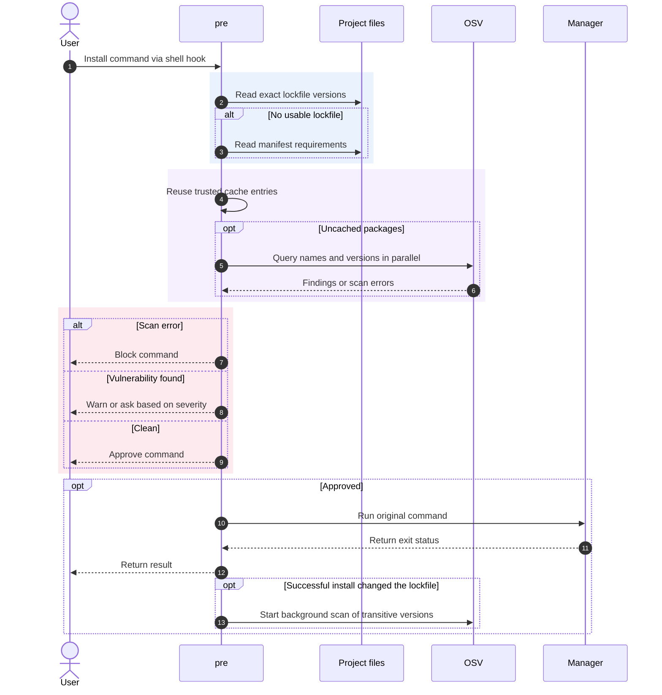
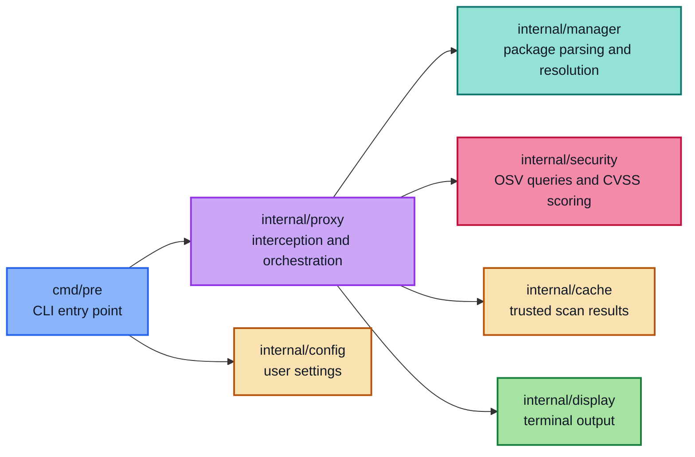

# pre≋≈~∿

Security guardrail for package managers. `pre` sits between your shell and `npm`, `pip`, `brew`, and friends. It checks requested versions and existing lockfiles against the [OSV vulnerability database](https://osv.dev) before the package manager runs.

[](https://github.com/yowainwright/pre/actions/workflows/test.yml)
[](https://github.com/yowainwright/pre/releases)
[](LICENSE)

Zero config. One runtime binary.

## Install

<!-- install methods and verification behavior from install.sh and release configuration -->

```sh
# Homebrew
brew install --cask yowainwright/tap/pre

# or curl (macOS + Linux; requires cosign on PATH)
curl -fsSL https://raw.githubusercontent.com/yowainwright/pre/main/install.sh | sh
```

Every release includes SHA-256 checksums and a Cosign signature. The curl installer requires `cosign` and verifies both before writing the binary. A missing bundle, missing `cosign` binary, or failed signature blocks installation.

The macOS cask is checksum-verified but not notarized; its install hook removes quarantine only from the staged `pre` binary.

## Setup

```sh
pre setup    # adds shell hooks to ~/.zshrc or ~/.bashrc
pre teardown # removes them
pre status   # shows install state, cache, managers, and scan status
```

After setup, supported install commands in interactive Zsh and Bash sessions go through `pre` automatically. Scripts and CI can call `pre <manager> ...` directly.

## Emergency controls

If anything goes wrong, bypass `pre` without editing shell files:

```sh
PRE_DISABLE=1 npm install react      # one command
export PRE_DISABLE=1                 # current shell session
pre teardown                         # remove shell hooks
pre self uninstall                   # remove the binary
```

Runtime switches:

| Env var | What it does |
|---------|--------------|
| `PRE_DISABLE=1` | Bypasses all `pre` scans and runs the package manager directly |
| `PRE_QUIET=1` | Hides scan progress and clean summaries; vulnerabilities and errors still print |
| `PRE_NO_BACKGROUND=1` | Disables detached background scans after installs |
| `PRE_MAX_PACKAGES=N` | Skips scanning when a manifest/lockfile expands beyond `N` packages |
| `PRE_DIAGNOSTICS=0` | Disables local diagnostics event recording |
| `PRE_DIAGNOSTICS_DIR=PATH` | Writes diagnostics to an alternate local state directory |

## Package manager UI

```sh
pre manage
# or
pre m
```

`pre manage` opens a full-screen view of installed packages across detected managers.

| Key | Action |
|-----|--------|
| `↑` / `↓` or `j` / `k` | Move between packages |
| `/` | Search as you type |
| `m` | Toggle managers |
| `enter` or `o` | Open package actions |
| `x` or `esc` | Close a dialog |
| `q` or `ctrl+c` | Exit |

The default theme uses Catppuccin Mocha colors. Set `PRE_MANAGE_THEME=contrast` for a brighter theme or `PRE_MANAGE_THEME=mono` for no color.

Actions run through `pre <manager> ...`, so installs and downgrades are scanned first.

`uv` targets the active environment with `uv pip`. Cargo edits project dependencies with `cargo add`, `cargo update`, and `cargo remove`.

Non-interactive package commands are available too:

```sh
pre installed                    # package inventory
pre manage --package react --manager npm --upgrade
pre manage --package react --manager npm --downgrade 18.2.0
pre manage --package ripgrep --uninstall
pre install npm react
pre update npm react
pre downgrade pip urllib3 1.24.1
pre uninstall brew ripgrep
```

## Docker E2E tests

```sh
make test-e2e-list
make test-e2e-docker E2E_TEST=npm
make test-e2e-docker E2E_TEST=pip
```

Requires Docker. Each scenario builds the same E2E container with `pre` installed and shell hooks active, then covers clean scanning, CVE detection, and a blocked install for one package manager.

## How it works


```mermaid
sequenceDiagram
    autonumber
    actor User
    participant Pre as pre
    participant Project as Project files
    participant OSV
    participant Manager

    User->>Pre: Install command via shell hook

    rect rgba(137, 180, 250, 0.18)
        Pre->>Project: Read exact lockfile versions
        alt No usable lockfile
            Pre->>Project: Read manifest requirements
        end
    end

    rect rgba(203, 166, 247, 0.18)
        Pre->>Pre: Reuse trusted cache entries
        opt Uncached packages
            Pre->>OSV: Query names and versions in parallel
            OSV-->>Pre: Findings or scan errors
        end
    end

    rect rgba(243, 139, 168, 0.18)
        alt Scan error
            Pre-->>User: Block command
        else Vulnerability found
            Pre-->>User: Warn or ask based on severity
        else Clean
            Pre-->>User: Approve command
        end
    end

    opt Approved
        Pre->>Manager: Run original command
        Manager-->>Pre: Return exit status
        Pre-->>User: Return result
        opt Successful install changed the lockfile
            Pre->>OSV: Start background scan of transitive versions
        end
    end
```

### What you'll see

| Situation | Output |
|-----------|--------|
| Everything cached and clean | Silent — install proceeds |
| New packages, no issues | `scanning 12 packages... all clean` |
| Low/medium CVE | Warning printed, install proceeds |
| High/critical CVE | CVE detail box shown, Y/N prompt |
| OSV or version-resolution error | Install blocked; `PRE_DISABLE=1` is the explicit bypass |

### Supported managers

<!-- lockfile support and source restrictions from internal/manager -->

`pre` reads existing lockfiles first because they contain exact direct and transitive versions. Without a usable lockfile, it falls back to the project manifest.

| Manager | Lockfile | Intercepted commands |
|---------|----------|----------------------|
| brew | `Brewfile.lock.json` | `install`, `reinstall`, `upgrade` |
| npm | `package-lock.json` | `install`, `add`, `i`, `update`, `ci` |
| pnpm | `pnpm-lock.yaml` | `install`, `add`, `i`, `update` |
| bun | `bun.lock` | `install`, `add`, `i`, `update` |
| go | `go.sum` | `get`, `install` |
| cargo | `Cargo.lock` | `add`, `install`, `update`, `fetch` |
| pip / pip3 | `Pipfile.lock` | `install` |
| uv | `uv.lock` | `add`, `sync`, `pip install` |
| poetry | `poetry.lock` | `add`, `update`, `install` |

If a command creates or changes a lockfile, `pre` checks the requested packages before the install. It scans the resolved lockfile in the background afterward unless `PRE_NO_BACKGROUND=1` is set.

### Commands that require exact resolution

`pre` blocks commands when it cannot map a dependency to an exact package and version.

Cargo scans crates.io dependencies from `Cargo.lock` or `Cargo.toml`. It resolves version requirements against non-yanked crates.io releases.

npm lockfile entries must match their `node_modules` package identity and resolve from `https://registry.npmjs.org`. Aliases, links, local files, tarball URLs, and custom registries block the command because OSV cannot identify their contents reliably; `PRE_DISABLE=1` is the explicit bypass.

Cargo commands are blocked for:

- Local path or Git dependencies
- Custom registries or an alternate default registry
- Offline resolution
- Resolution-changing unstable options or Cargo configuration
- `--config` or `--lockfile-path`

Workspace-wide `cargo fetch` requires the shared `Cargo.lock`; run `cargo generate-lockfile` first when creating a workspace lockfile.

`uv sync` and lockfile-wide Poetry commands require an existing `uv.lock` or `poetry.lock`. Run `uv lock` or `poetry lock` first so the pre-install scan has exact versions.

`PRE_DISABLE=1` is the explicit bypass.

## Commands

```sh
pre setup                     # inject shell hooks
pre teardown                  # remove shell hooks
pre status                    # pre install state, managers, cache size, last system scan
pre manage                    # package manager TUI
pre m                         # short alias for pre manage
pre installed                 # package inventory
pre manage --package <pkg> --manager <mgr> --upgrade [version]
pre manage --package <pkg> --manager <mgr> --downgrade <version>
pre manage --package <pkg> --manager <mgr> --uninstall
pre install <mgr> <pkg>       # install a package through pre
pre update <mgr> [pkg]        # update a package, or all where supported
pre downgrade <mgr> <pkg> <v> # install an older package version
pre uninstall <mgr> <pkg>     # remove a package
pre config                    # show current config
pre config set <key> <value>  # update a config value
pre diagnostics status        # local event count, size, and rotation state
pre diagnostics events        # recent sanitized JSONL events
pre diagnostics export        # write a shareable sanitized report
pre diagnostics clear         # remove local diagnostic event logs
pre skills add [--global]     # install the agent skill to .claude/skills (~/.claude with --global)
pre skills show               # print the agent skill to stdout
pre scan system               # scan all cached packages now
pre self update               # update the pre binary
pre self uninstall [--purge]  # remove pre itself
```

## Configuration

`~/.config/pre/config.json` — edit directly or use `pre config set`.

| Key | Default | What it does |
|-----|---------|--------------|
| `api.endpoint` | `https://api.osv.dev/v1/query` | OSV-compatible API to query |
| `cache.ttl` | `24h` | How long a clean result is trusted |
| `systemScan` | `false` | Weekly background scan of cached packages |
| `systemTTL` | `168h` | How often the background scan runs |
| `managers` | — | Add or override managers |

**Quick examples:**

```sh
pre config set cache.ttl 12h
pre config set systemScan true
PRE_CACHE_TTL=0s npm install   # bypass cache for one install
PRE_QUIET=1 npm install        # hide clean scan output
PRE_DISABLE=1 npm install      # emergency bypass
```

## Diagnostics

`pre` records local diagnostic events so developers can see and share what the
tool decided without exposing private work:

```sh
pre diagnostics status
pre diagnostics events --since 24h --limit 50
pre diagnostics export --since 24h
pre diagnostics clear
```

Diagnostics stay on your machine unless you explicitly export and share a
report. Events include manager names, command categories, decision reasons,
package counts, cache sizes, durations, exit codes, and Go runtime memory /
goroutine samples.

Diagnostics do not record command text, full arguments, paths, environment
variables, package names by default, OSV response bodies, prompts, completions,
or plugin contents. Event logs are bounded and rotated locally.

**Custom manager** (add to `managers` array in config):

```json
{
  "name": "composer",
  "ecosystem": "Packagist",
  "installCmds": ["install", "require"]
}
```

Entries matching a built-in `name` replace it; new names extend the list.

## Security model

<!-- security behavior from internal/proxy, internal/manager, and install.sh -->

- Queries [OSV.dev](https://osv.dev), a free service operated by Google
- Sends only the package name and version; no code leaves your machine
- Uses existing lockfiles to check exact transitive versions before installation
- Blocks the package manager if OSV, version resolution, or project reading fails; `PRE_DISABLE=1` is the explicit bypass
- Checks newly resolved transitive dependencies after installation
- Records local diagnostics for developer-owned troubleshooting; diagnostics are never uploaded automatically
- Publishes SHA-256 checksums signed with keyless Cosign for every platform
- Curl installs require successful Cosign verification of the release checksums

`pre` is a vulnerability guardrail, not a sandbox or full supply-chain policy. Keep lockfiles, review dependency changes, and run ecosystem-native audit tools in CI.

## Update pre

<!-- self-update behavior from cmd/pre and install.sh -->

```sh
pre self update
```

Homebrew installs run `brew upgrade --cask pre`. Curl/manual installs rerun the checksum-and-signature-verifying installer into the current binary directory and require `cosign` on `PATH`.

## Uninstall pre

```sh
pre self uninstall
pre self uninstall --purge # also removes config/cache data
```

Homebrew installs run `brew uninstall --cask pre`. Manual installs remove the current `pre` binary after removing shell hooks.

## Runtime architecture


```mermaid
flowchart LR
    CLI["cmd/pre<br/>CLI entry point"]
    PROXY["internal/proxy<br/>interception and orchestration"]
    CONFIG["internal/config<br/>user settings"]
    MANAGER["internal/manager<br/>package parsing and resolution"]
    SECURITY["internal/security<br/>OSV queries and CVSS scoring"]
    CACHE["internal/cache<br/>trusted scan results"]
    DISPLAY["internal/display<br/>terminal output"]

    CLI --> PROXY
    CLI --> CONFIG
    PROXY --> MANAGER
    PROXY --> SECURITY
    PROXY --> CACHE
    PROXY --> DISPLAY

    classDef entry fill:#89b4fa,stroke:#2563eb,color:#111827,stroke-width:2px
    classDef core fill:#cba6f7,stroke:#9333ea,color:#111827,stroke-width:2px
    classDef manager fill:#94e2d5,stroke:#0f766e,color:#111827,stroke-width:2px
    classDef security fill:#f38ba8,stroke:#be123c,color:#111827,stroke-width:2px
    classDef state fill:#f9e2af,stroke:#b45309,color:#111827,stroke-width:2px
    classDef output fill:#a6e3a1,stroke:#15803d,color:#111827,stroke-width:2px

    class CLI entry
    class PROXY core
    class MANAGER manager
    class SECURITY security
    class CONFIG,CACHE state
    class DISPLAY output
```

## Repository layout

```text
cmd/pre/           CLI dispatch, lifecycle, package management, and screenshots
internal/manager/  Package-manager definitions, manifests, lockfiles, and versions
internal/proxy/    Command interception, scanning, shell hooks, and rendering
internal/security/ OSV client and severity scoring
internal/skills/   Embedded pre skill
scripts/           Setup and release automation
tests/e2e/          Go and Docker package-manager tests
tests/integration/  Live-service tests
tests/scripts/      Shell tests
```

Ecosystem-specific files use `<capability>_<ecosystem>.go`. Unit tests live beside
their source and use matching filenames; `tests/` is reserved for cross-process
and live-service coverage. The root `install.sh` remains the public curl-install
entry point packaged with each release.

## Development

```sh
make setup            # install deps, verify secrets, install git hooks
mise install          # install the pinned release versioning tool
make test             # unit tests
make test-race        # unit tests with the race detector
make test-e2e         # end-to-end (requires npm)
make test-integration # live API calls (requires network)
make test-scripts     # shell script tests
make lint             # format check + vet
make gosec            # static security checks (requires Go 1.26+)
make vuln             # govulncheck scan (requires network)
make security         # govulncheck + gosec
make screenshots      # generate TUI SVG screenshots in dist/screenshots
make snapshot         # local release dry-run (all 4 binaries, no publish)
make release-preview  # full beta release validation, no publish
make release          # interactive version prompt, validation, tag, and CI release
make test-e2e-list    # list Docker E2E tests
make test-e2e-docker E2E_TEST=npm # run one Docker E2E test
```

## License

MIT
