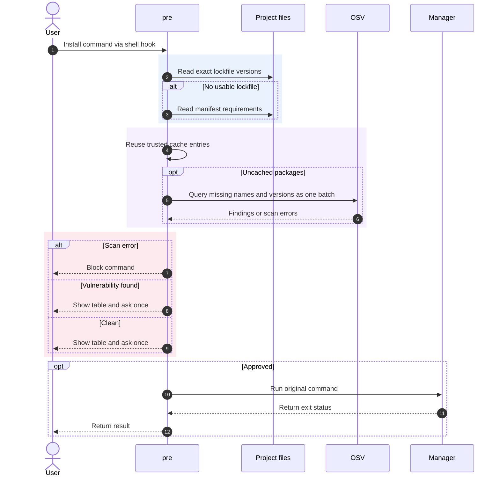

# pre≋≈~∿

Security guardrail for package managers. `pre` sits between your shell and `npm`, `pip`, `brew`, and friends. It checks requested versions and existing lockfiles against the [OSV vulnerability database](https://osv.dev) before the package manager runs.

[](https://github.com/yowainwright/pre/actions/workflows/test.yml)
[](https://github.com/yowainwright/pre/releases)
[](LICENSE)

Zero config. One runtime binary.

## Install

### Homebrew

```sh
brew install --cask yowainwright/tap/pre
```

The macOS cask is checksum-verified but not notarized; its install hook removes quarantine only from the staged `pre` binary.

### Curl

For macOS and Linux; requires `cosign` on `PATH`.

```sh
curl -fsSL https://raw.githubusercontent.com/yowainwright/pre/main/install.sh | sh
```

Every release includes SHA-256 checksums and a Cosign signature. The curl installer requires `cosign` and verifies both before writing the binary. A missing bundle, missing `cosign` binary, or failed signature blocks installation.

## Setup

```sh
pre setup
```

Adds shell hooks to `~/.zshrc` or `~/.bashrc`. Supported install commands in interactive Zsh and Bash sessions then go through `pre` automatically. Scripts and CI can call `pre <manager> ...` directly.

Example output (Zsh):

```text
pre: added hooks to /home/user/.zshrc
pre: restart your shell or run: source /home/user/.zshrc
```

[Check status](#pre-status) or [remove the hooks](#pre-teardown).

## Emergency controls

If anything goes wrong, bypass `pre` without editing shell files:

### Bypass one command

```sh
PRE_DISABLE=1 npm install react
```

### Bypass the current session

```sh
export PRE_DISABLE=1
```

To remove interception permanently, [remove the hooks](#pre-teardown) or [uninstall pre](#pre-self-uninstall).

### Bypass the cache for one install

```sh
PRE_CACHE_TTL=0s npm install
```

### Hide clean scan output

```sh
PRE_QUIET=1 npm install
```

### Runtime switches

| Env var | What it does |
|---------|--------------|
| `PRE_DISABLE=1` | Bypasses all `pre` scans and runs the package manager directly |
| `PRE_QUIET=1` | Hides scan progress and clean summaries; vulnerabilities and errors still print |
| `PRE_MAX_PACKAGES=N` | Blocks installs that expand beyond `N` packages; manual `pre scan system` skips instead |
| `PRE_CACHE_MAX_ENTRIES=N` | Prunes the approval cache to at most `N` entries |
| `PRE_CACHE_MAX_BYTES=N` | Prunes the approval cache to at most `N` bytes |
| `PRE_OBS=0` | Disables local obs event recording |
| `PRE_OBS_DIR=PATH` | Writes obs events to an alternate local state directory |

## How it works


```mermaid
sequenceDiagram
    autonumber
    actor User
    participant Pre as pre
    participant Project as Project files
    participant OSV
    participant Manager

    User->>Pre: Install command via shell hook

    rect rgba(137, 180, 250, 0.18)
        Pre->>Project: Read exact lockfile versions
        alt No usable lockfile
            Pre->>Project: Read manifest requirements
        end
    end

    rect rgba(203, 166, 247, 0.18)
        Pre->>Pre: Reuse trusted cache entries
        opt Uncached packages
            Pre->>OSV: Query missing names and versions as one batch
            OSV-->>Pre: Findings or scan errors
        end
    end

    rect rgba(243, 139, 168, 0.18)
        alt Scan error
            Pre-->>User: Block command
        else Vulnerability found
            Pre-->>User: Show table and ask once
        else Clean
            Pre-->>User: Show table and ask once
        end
    end

    opt Approved
        Pre->>Manager: Run original command
        Manager-->>Pre: Return exit status
        Pre-->>User: Return result
    end
```

Supports brew, npm, pnpm, Bun, Go, Cargo, pip/pip3, uv, and Poetry.

Trusted cached packages proceed silently. Other scans show findings and ask for approval. Scan or version-resolution errors block the command; `PRE_DISABLE=1` bypasses scanning.

### Resolution limits

- npm sources must use `https://registry.npmjs.org` and match the lockfile package identity. Aliases, links, local files, tarballs, and custom registries are blocked.
- Cargo supports crates.io releases, not local/Git dependencies, alternate registries, offline resolution, or resolution-changing configuration and unstable options. `--config` and `--lockfile-path` are blocked.
- Workspace-wide `cargo fetch` needs a shared `Cargo.lock`; create it with `cargo generate-lockfile` first.
- `uv sync` and lockfile-wide Poetry commands need existing lockfiles. Create them with `uv lock` or `poetry lock` first.

## CLI API

### `pre teardown`

Remove the shell hooks added by [setup](#setup).

```sh
pre teardown
```

Example output (Zsh):

```text
pre: removed hooks from /home/user/.zshrc
pre: restart your shell or run: source /home/user/.zshrc
```

### `pre status`

Show install state, managers, cache size, and the last manual system scan.

```sh
pre status
```

Example output (excerpt):

```text
cached: 2 packages
system scan: no manual scan yet
```

### `pre manage`

Browse installed packages and manage them in a full-screen UI. Alias: `pre m`.

```sh
pre manage
```

| Key | Action |
|-----|--------|
| `↑` / `↓` or `j` / `k` | Move between packages |
| `/` | Search as you type |
| `m` | Toggle managers |
| `enter` or `o` | Open package actions |
| `x` or `esc` | Close a dialog |
| `q` or `ctrl+c` | Exit |

Set `PRE_MANAGE_THEME=contrast` for a brighter theme or `PRE_MANAGE_THEME=mono` for no color. Installs and downgrades are scanned first.

`uv` targets the active environment with `uv pip`; Cargo actions edit project dependencies.

#### `--upgrade`

Upgrade without opening the UI. An optional version selects a specific release.

```sh
pre manage --package react --manager npm --upgrade 19.0.0
```

Example `package.json` change:

```diff
 {
   "dependencies": {
-    "react": "^18.2.0",
+    "react": "^19.0.0",
     "zod": "^3.24.1"
   }
 }
```

#### `--downgrade`

Install a specific older version without opening the UI.

```sh
pre manage --package react --manager npm --downgrade 18.2.0
```

Example `package.json` change:

```diff
 {
   "dependencies": {
-    "react": "^19.0.0",
+    "react": "^18.2.0",
     "zod": "^3.24.1"
   }
 }
```

#### `--uninstall`

Remove a package without opening the UI.

```sh
pre manage --package react --manager npm --uninstall
```

Example `package.json` change:

```diff
 {
   "dependencies": {
-    "react": "^18.2.0",
     "zod": "^3.24.1"
   }
 }
```

### `pre installed`

List installed packages across detected managers.

```sh
pre installed
```

Example output:

```text
installed packages:
    1  npm      react                                18.2.0
    2  npm      zod                                  3.24.1
```

### `pre install`

Scan a package, then install it with the named manager after approval.

```sh
pre install npm react@18.2.0
```

Example `package.json` change:

```diff
 {
   "dependencies": {
+    "react": "^18.2.0",
     "zod": "^3.24.1"
   }
 }
```

### `pre update`

Update a package. Omitting the package requests a manager-wide update, which is blocked when exact versions cannot be resolved before installation.

```sh
pre update npm react
```

Example `package.json` change (the resolved version varies):

```diff
 {
   "dependencies": {
-    "react": "^18.2.0",
+    "react": "^19.0.0",
     "zod": "^3.24.1"
   }
 }
```

### `pre downgrade`

Install an older package version.

```sh
pre downgrade npm react 18.2.0
```

Example `package.json` change:

```diff
 {
   "dependencies": {
-    "react": "^19.0.0",
+    "react": "^18.2.0",
     "zod": "^3.24.1"
   }
 }
```

### `pre uninstall`

Remove a package with the named manager.

```sh
pre uninstall npm react
```

Example `package.json` change:

```diff
 {
   "dependencies": {
-    "react": "^18.2.0",
     "zod": "^3.24.1"
   }
 }
```

### `pre config`

Show the API endpoint and cache TTL.

```sh
pre config
```

Default output:

```text
api.endpoint  https://api.osv.dev/v1/query
cache.ttl     24h
```

### `pre config set`

Set `api.endpoint` or `cache.ttl`. [pre status](#pre-status) shows the config file's location.

```sh
pre config set cache.ttl 12h
```

Example `config.json` change (excerpt):

```diff
 {
   "cache": {
-    "ttl": "24h"
+    "ttl": "12h"
   }
 }
```

#### Custom managers

Add an entry to the config's `managers` array. A matching name replaces a built-in manager; a new name extends the list.

Example `config.json` change (excerpt):

```diff
 {
-  "managers": []
+  "managers": [
+    {
+      "name": "composer",
+      "ecosystem": "Packagist",
+      "installCmds": ["install", "require"]
+    }
+  ]
 }
```

### `pre obs`

Show cache, process, and scan summaries with local events.

```sh
pre obs
```

Example output (excerpt):

```text
process:
  background: none
scans:
  allowed: 2
  blocked: 1
  failed: 0
```

Logs stay local and rotate automatically. Events omit command arguments, paths, environment variables, and package names by default.

#### `--json`

Return the same response as JSON.

```sh
pre obs --json
```

Example output (excerpt):

```json
{
  "scans": {
    "allowed": 2,
    "blocked": 1,
    "failed": 0
  }
}
```

#### `--events`

List events matching a text query. Omit the query to list all events.

```sh
pre obs --events scan
```

Example output:

```text
  - 2026-09-07T12:00:00Z pre.scan.completed
  - 2026-09-07T12:00:01Z pre.scan.approved
```

### `pre skills add`

Install the agent skill in `.claude/skills/pre`. Add `--global` to install under your home directory instead.

```sh
pre skills add
```

New `.claude/skills/pre/SKILL.md` (excerpt):

```diff
+---
+name: pre
+description: >
+  Use when installing, configuring, or troubleshooting pre, the security
+  proxy that scans packages against the OSV database before package
+  managers install them.
+---
```

### `pre skills show`

Print the bundled agent skill.

```sh
pre skills show
```

Output excerpt:

```text
# pre

Run `pre setup` once to install shell hooks in ~/.zshrc or ~/.bashrc.
Run `pre status` for read-only install state, managers, and cache info.
Run `pre teardown` to remove shell hooks.
```

### `pre scan system`

Scan cached packages, not a full inventory of installed software. Runs silently; view results with [pre status](#pre-status).

```sh
pre scan system
```

Example `pre status` change after a successful scan:

```diff
-system scan: no manual scan yet
+system scan: 2 total · 0 crit · 0 warn · last run 2026-09-07 12:00
```

### `pre self update`

Update `pre` through Homebrew or the verified curl installer. Curl/manual installs require `cosign` on `PATH`.

```sh
pre self update
```

Example progress output (Homebrew):

```text
pre: updating with Homebrew
```

### `pre self uninstall`

Remove shell hooks and `pre` itself. Add `--purge` to also remove config and cache data.

```sh
pre self uninstall
```

Example output (manual install):

```text
pre: removed hooks from /home/user/.zshrc
pre: removed binary /usr/local/bin/pre
```

## Security model

- Queries [OSV.dev](https://osv.dev), a free service operated by Google
- Sends only the package name and version; no code leaves your machine
- Uses existing lockfiles to check exact transitive versions before installation
- Blocks the package manager if OSV, version resolution, or project reading fails; `PRE_DISABLE=1` is the explicit bypass
- Checks package sets before installation when they need approval
- Records local obs for developer-owned troubleshooting; obs is never uploaded automatically
- Publishes SHA-256 checksums signed with keyless Cosign for every platform
- Curl installs require successful Cosign verification of the release checksums

`pre` is a vulnerability guardrail, not a sandbox or full supply-chain policy. Keep lockfiles, review dependency changes, and run ecosystem-native audit tools in CI.

## Repository layout

```text
cmd/pre/           CLI dispatch, lifecycle, package management, and screenshots
internal/manager/  Package-manager definitions, manifests, lockfiles, and versions
internal/proxy/    Command interception, scanning, shell hooks, and rendering
internal/security/ OSV client and severity scoring
internal/skills/   Embedded pre skill
scripts/           Setup and release automation
tests/e2e/          Go and Docker package-manager tests
tests/integration/  Live-service tests
tests/scripts/      Shell tests
```

Ecosystem-specific files use `<capability>_<ecosystem>.go`. Unit tests live beside
their source and use matching filenames; `tests/` is reserved for cross-process
and live-service coverage. The root `install.sh` remains the public curl-install
entry point packaged with each release.

## Development

Follow [AGENTS.md](AGENTS.md): change one file, show the diff, and wait for human approval before changing another.

### Setup

Install pinned tools, check prerequisites and secrets, and install Git and agent hooks.

```sh
make setup
```

### Unit tests

```sh
make test
```

### Lint

Check formatting, vet Go code, and lint Go and shell files.

```sh
make lint
```

See the [Makefile](Makefile) for other tests, security checks, and release commands.

## Docker E2E tests

Requires Docker. Each scenario tests clean scanning, CVE detection, and blocked installs with shell hooks active in a container.

### List scenarios

```sh
make test-e2e-list
```

### npm scenario

```sh
make test-e2e-docker E2E_TEST=npm
```

### pip scenario

```sh
make test-e2e-docker E2E_TEST=pip
```

## License

MIT
