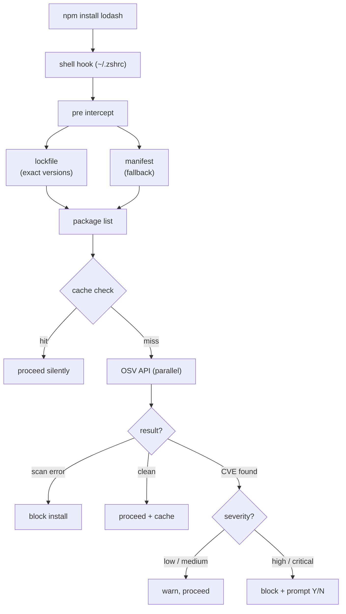
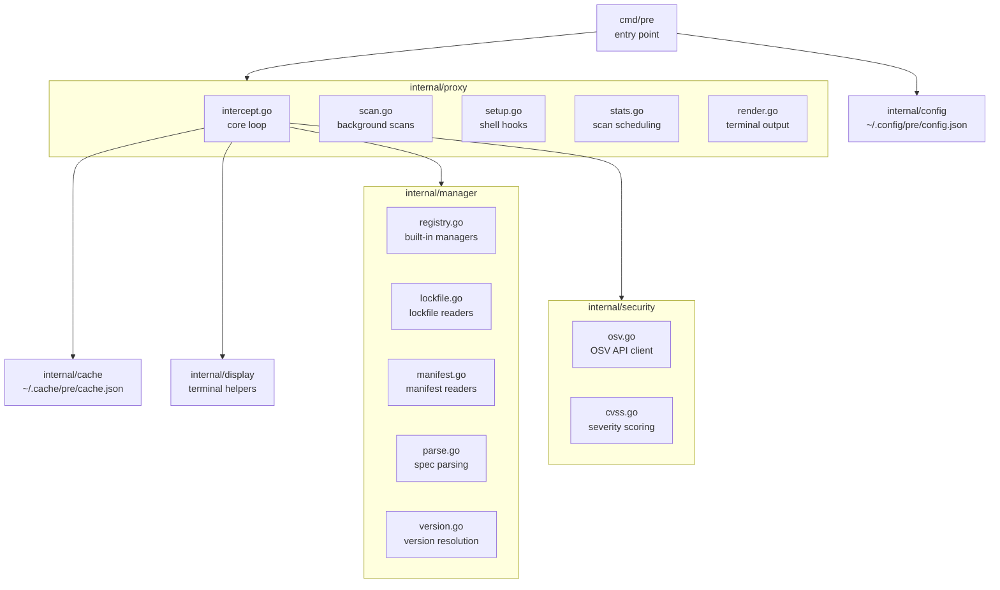

# pre≋≈~∿

Security guardrail for package managers. Sits between your shell and `npm`, `pip`, `brew`, and friends, checking requested versions and existing lockfiles against the [OSV vulnerability database](https://osv.dev) before the package manager runs.

[](https://github.com/yowainwright/pre/actions/workflows/test.yml)
[](https://github.com/yowainwright/pre/releases)
[](LICENSE)

Zero config. Zero dependencies. One binary.

## Install

```sh
# Homebrew
brew install --cask yowainwright/tap/pre

# or curl (macOS + Linux)
curl -fsSL https://raw.githubusercontent.com/yowainwright/pre/main/install.sh | sh
```

Every release ships with SHA256 checksums and a cosign signature. The install script verifies the checksum automatically; if `cosign` is on your PATH, signature verification must pass too.

The macOS cask is checksum-verified but not notarized; its install hook removes quarantine only from the staged `pre` binary.

## Setup

```sh
pre setup    # adds shell hooks to ~/.zshrc or ~/.bashrc
pre teardown # removes them
pre status   # shows install state, cache, managers, and scan status
```

After setup, supported install commands in interactive Zsh and Bash sessions go through `pre` automatically. Scripts and CI can call `pre <manager> ...` directly.

## Emergency controls

If anything goes wrong, bypass `pre` without editing shell files:

```sh
PRE_DISABLE=1 npm install react      # one command
export PRE_DISABLE=1                 # current shell session
pre teardown                         # remove shell hooks
pre self uninstall                   # remove the binary
```

Runtime switches:

| Env var | What it does |
|---------|--------------|
| `PRE_DISABLE=1` | Bypasses all `pre` scans and runs the package manager directly |
| `PRE_QUIET=1` | Hides scan progress and clean summaries; vulnerabilities and errors still print |
| `PRE_NO_BACKGROUND=1` | Disables detached background scans after installs |
| `PRE_MAX_PACKAGES=N` | Skips scanning when a manifest/lockfile expands beyond `N` packages |

## Package Manager

```sh
pre manage
# or
pre m
```

The manager opens a full-screen, keyboard-driven terminal UI for installed packages from available managers. It supports themed rows, arrow or `j`/`k` navigation, live `/` search with no enter-to-apply step, `m` manager toggles, `enter`/`o` action dialogs, `x`/`esc` dialog close, and `q` or `ctrl+c` exit. The default theme uses Catppuccin Mocha truecolor values; set `PRE_MANAGE_THEME=contrast` for a brighter theme or `PRE_MANAGE_THEME=mono` for no color. Package actions run back through `pre <manager> ...`, so install and downgrade flows still use the vulnerability scan before the package manager runs. `uv` actions target the active environment with `uv pip ...`; Cargo actions edit project dependencies with `cargo add`, `cargo update`, and `cargo remove`.

Non-interactive package commands are available too:

```sh
pre installed                    # package inventory
pre manage --package react --manager npm --upgrade
pre manage --package react --manager npm --downgrade 18.2.0
pre manage --package ripgrep --uninstall
pre install npm react
pre update npm react
pre downgrade pip urllib3 1.24.1
pre uninstall brew ripgrep
```

## Demo

```sh
make demo
```

Requires Docker. Builds a container with `pre` installed and shell hooks active, then plays through real scans across npm and pip — clean installs, CVE detection, and blocked installs. Colors render fully via the TTY allocated by `docker run -it`.

## How it works


```mermaid
flowchart TD
    A["npm install lodash"] --> B["shell hook (~/.zshrc)"]
    B --> C["pre intercept"]
    C --> D["lockfile\n(exact versions)"]
    C --> E["manifest\n(fallback)"]
    D --> F["package list"]
    E --> F
    F --> G{"cache check"}
    G -->|hit| H["proceed silently"]
    G -->|miss| I["OSV API (parallel)"]
    I --> J{"result?"}
    J -->|scan error| O["block install"]
    J -->|clean| K["proceed + cache"]
    J -->|CVE found| L{"severity?"}
    L -->|low / medium| M["warn, proceed"]
    L -->|high / critical| N["block + prompt Y/N"]
```

### What you'll see

| Situation | Output |
|-----------|--------|
| Everything cached and clean | Silent — install proceeds |
| New packages, no issues | `scanning 12 packages... all clean` |
| Low/medium CVE | Warning printed, install proceeds |
| High/critical CVE | CVE detail box shown, Y/N prompt |
| OSV or version-resolution error | Install blocked; `PRE_DISABLE=1` is the explicit bypass |

### Lockfile-first scanning

`pre` reads existing lockfiles for exact pinned versions, including transitive dependencies, before falling back to manifests:

| Manager | Lockfiles |
|---------|-----------|
| npm | `package-lock.json` |
| bun | `bun.lock` |
| pnpm | `pnpm-lock.yaml` |
| go | `go.sum` |
| cargo | `Cargo.lock` |
| pip / pip3 | `Pipfile.lock` |
| uv | `uv.lock` |
| poetry | `poetry.lock` |
| brew | `Brewfile.lock.json` |

Supported managers: `brew`, `npm`, `pnpm`, `bun`, `go`, `cargo`, `pip`, `pip3`, `uv`, `poetry`

Intercepted commands:

| Manager | Commands |
|---------|----------|
| brew | `install`, `reinstall`, `upgrade` |
| npm | `install`, `add`, `i`, `update`, `ci` |
| pnpm / bun | `install`, `add`, `i`, `update` |
| go | `get`, `install` |
| cargo | `add`, `install`, `update`, `fetch` |
| pip / pip3 | `install` |
| uv | `add`, `sync`, `pip install` |
| poetry | `add`, `update`, `install` |

When an install creates or changes a lockfile, newly resolved transitive dependencies are not knowable in advance. The requested packages are checked first and the resulting lockfile is scanned in the background after a successful install unless `PRE_NO_BACKGROUND=1` is set.

Cargo scans crates.io dependencies from `Cargo.lock` or `Cargo.toml` and resolves version requirements against non-yanked crates.io releases. Path, Git, custom-registry, alternate-default-registry, offline resolution, resolution-changing unstable options, `--config`, `--lockfile-path`, and resolution-changing Cargo config block the command because OSV cannot identify them reliably as crates.io packages; `PRE_DISABLE=1` is the explicit bypass.

Workspace-wide `cargo fetch` requires the shared `Cargo.lock`; run `cargo generate-lockfile` first when creating a workspace lockfile.

`uv sync` and lockfile-wide Poetry commands require an existing `uv.lock` or `poetry.lock`. Run `uv lock` or `poetry lock` first so the pre-install scan has exact versions.

## Commands

```sh
pre setup                     # inject shell hooks
pre teardown                  # remove shell hooks
pre status                    # pre install state, managers, cache size, last system scan
pre manage                    # package manager TUI
pre m                         # short alias for pre manage
pre installed                 # package inventory
pre manage --package <pkg> --manager <mgr> --upgrade [version]
pre manage --package <pkg> --manager <mgr> --downgrade <version>
pre manage --package <pkg> --manager <mgr> --uninstall
pre install <mgr> <pkg>       # install a package through pre
pre update <mgr> [pkg]        # update a package, or all where supported
pre downgrade <mgr> <pkg> <v> # install an older package version
pre uninstall <mgr> <pkg>     # remove a package
pre config                    # show current config
pre config set <key> <value>  # update a config value
pre skills add [--global]     # install the agent skill to .claude/skills (~/.claude with --global)
pre skills show               # print the agent skill to stdout
pre scan system               # scan all cached packages now
pre self update               # update the pre binary
pre self uninstall [--purge]  # remove pre itself
```

## Configuration

`~/.config/pre/config.json` — edit directly or use `pre config set`.

| Key | Default | What it does |
|-----|---------|--------------|
| `api.endpoint` | `https://api.osv.dev/v1/query` | OSV-compatible API to query |
| `cache.ttl` | `24h` | How long a clean result is trusted |
| `systemScan` | `false` | Weekly background scan of cached packages |
| `systemTTL` | `168h` | How often the background scan runs |
| `managers` | — | Add or override managers |

**Quick examples:**

```sh
pre config set cache.ttl 12h
pre config set systemScan true
PRE_CACHE_TTL=0s npm install   # bypass cache for one install
PRE_QUIET=1 npm install        # hide clean scan output
PRE_DISABLE=1 npm install      # emergency bypass
```

**Custom manager** (add to `managers` array in config):

```json
{
  "name": "composer",
  "ecosystem": "Packagist",
  "installCmds": ["install", "require"]
}
```

Entries matching a built-in `name` replace it; new names extend the list.

## Security model

- Queries [OSV.dev](https://osv.dev) — Google-operated, free, open
- Only package name + version leave your machine — no code uploaded
- Existing lockfiles provide exact pre-install checks for transitive dependencies
- OSV, version-resolution, and detected project-read errors block the package manager; `PRE_DISABLE=1` is an explicit fail-open override
- Newly resolved transitive dependencies are checked after installation
- Release checksums signed with cosign (Sigstore keyless) on every release
- SHA256 checksums for all platforms

`pre` is a vulnerability guardrail, not a sandbox or a complete software-supply-chain policy. Keep lockfiles, review dependency changes, and run ecosystem-native audit tooling in CI.

## Update pre

```sh
pre self update
```

Homebrew installs run `brew upgrade --cask pre`. Curl/manual installs rerun the checksum-verifying installer into the current binary directory.

## Uninstall pre

```sh
pre self uninstall
pre self uninstall --purge # also removes config/cache data
```

Homebrew installs run `brew uninstall --cask pre`. Manual installs remove the current `pre` binary after removing shell hooks.

## Project layout


```mermaid
graph TD
    CMD["cmd/pre\nentry point"] --> PROXY

    subgraph PROXY["internal/proxy"]
        I["intercept.go\ncore loop"]
        SC["scan.go\nbackground scans"]
        ST["setup.go\nshell hooks"]
        SS["stats.go\nscan scheduling"]
        R["render.go\nterminal output"]
    end

    subgraph MGR["internal/manager"]
        REG["registry.go\nbuilt-in managers"]
        LF["lockfile.go\nlockfile readers"]
        MF["manifest.go\nmanifest readers"]
        PA["parse.go\nspec parsing"]
        VR["version.go\nversion resolution"]
    end

    subgraph SEC["internal/security"]
        OSV["osv.go\nOSV API client"]
        CV["cvss.go\nseverity scoring"]
    end

    CACHE["internal/cache\n~/.cache/pre/cache.json"]
    CONFIG["internal/config\n~/.config/pre/config.json"]
    DISPLAY["internal/display\nterminal helpers"]

    I --> MGR
    I --> SEC
    I --> CACHE
    I --> DISPLAY
    CMD --> CONFIG
```

## Development

```sh
make setup       # install deps, verify secrets, install git hooks
make test        # unit tests
make e2e         # end-to-end (requires npm)
make integration # live API calls (requires network)
make lint        # format check + vet
make gosec       # static security checks (requires Go 1.26+)
make vuln        # govulncheck scan (requires network)
make security    # govulncheck + gosec
make screenshots # generate TUI SVG screenshots in dist/screenshots
make snapshot    # local release dry-run (all 4 binaries, no publish)
make release-preview # full beta release validation, no publish
make demo        # run in Docker
```

## License

MIT
