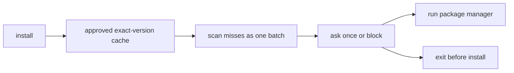

# pre

Run `pre setup` once to install shell hooks in ~/.zshrc or ~/.bashrc.
Run `pre status` for read-only install state, managers, and cache info.
Run `pre teardown` to remove shell hooks.

After setup, supported install commands in interactive Zsh and Bash sessions
are scanned automatically. Scripts and CI can call `pre <manager> ...`.

Supported managers: brew, npm, pnpm, bun, go, cargo, pip, pip3, uv, poetry.
Common lockfile installs include `npm ci`, `cargo fetch`, `cargo update`,
`uv sync`, `uv pip install`, and `poetry install`.
npm package-lock entries must match their package path and resolve from the
official npm registry. Aliases, links, local sources, and custom registries
require `PRE_DISABLE=1`.
Cargo scanning supports crates.io only. Path, Git, alternate-registry,
`--config`, `--lockfile-path`, and resolution-changing config require
`PRE_DISABLE=1`.
Run `uv lock` or `poetry lock` before lockfile-wide sync/install commands.

## Emergency bypass

Never edit shell files to bypass pre. Use:

```sh
PRE_DISABLE=1 npm install react   # one command
export PRE_DISABLE=1              # current shell session
pre teardown                      # remove hooks entirely
```

## Runtime switches

| Env var | Effect |
|---------|--------|
| `PRE_DISABLE=1` | Skip all scans, run the package manager directly |
| `PRE_QUIET=1` | Hide progress and clean summaries; CVEs still print |
| `PRE_MAX_PACKAGES=N` | Block installs past N packages; manual `pre scan system` skips |
| `PRE_CACHE_TTL=0s` | Bypass cache for one install |
| `PRE_CACHE_MAX_ENTRIES=N` | Prune the approval cache to at most N entries |
| `PRE_CACHE_MAX_BYTES=N` | Prune the approval cache to at most N bytes |
| `PRE_OBS=0` | Disable local obs recording |

## Install safety flow

`pre` runs inline, not in the background: cache hit, batch preflight, one prompt,
then run or block before the package manager starts.



## Package commands

```sh
pre installed                     # package inventory across managers
pre install <mgr> <pkg>           # install through the scanner
pre update <mgr> [pkg]            # update one or all
pre downgrade <mgr> <pkg> <ver>   # install an older version
pre uninstall <mgr> <pkg>         # remove a package
pre scan system                   # scan all cached packages now
pre obs                           # local cache/process/scan summary plus events
pre obs --json                    # same response as JSON
pre obs --events [query]          # recent events, optionally filtered by text
```

`pre manage` opens an interactive TUI — avoid it in non-interactive agent
sessions; use the flag form instead:

```sh
pre manage --package <pkg> --manager <mgr> --upgrade [version]
```

## Agent Setup

```sh
pre skills add           # install this skill to ./.claude/skills/pre/SKILL.md
pre skills add --global  # install to ~/.claude/skills/pre/SKILL.md
pre skills show          # print to stdout for other agent configs
```

## Config

`pre config` shows config; `pre config set <key> <value>` updates it.
Keys: `api.endpoint`, `cache.ttl`, `managers`.

## Agent loop

1. Run `pre status` to check install state.
2. If hooks are missing and interception is wanted, run `pre setup`.
3. Run installs normally; uncached exact versions require one approval prompt.
4. Scan, version-resolution, or detected project-read errors fail closed. Use
   `PRE_DISABLE=1` only as an explicit, reported bypass.
5. Batch/project installs are checked before installation and approved once.
6. In non-interactive sessions, inspect failures and choose a safe version.
7. Report scan results and any bypasses used.
8. For confusing plugin behavior, run `pre obs --json`.

Obs is local-only until the developer copies and shares command output. It does not
record command text, full arguments, paths, environment variables, package
names by default, prompts, completions, or plugin contents.
